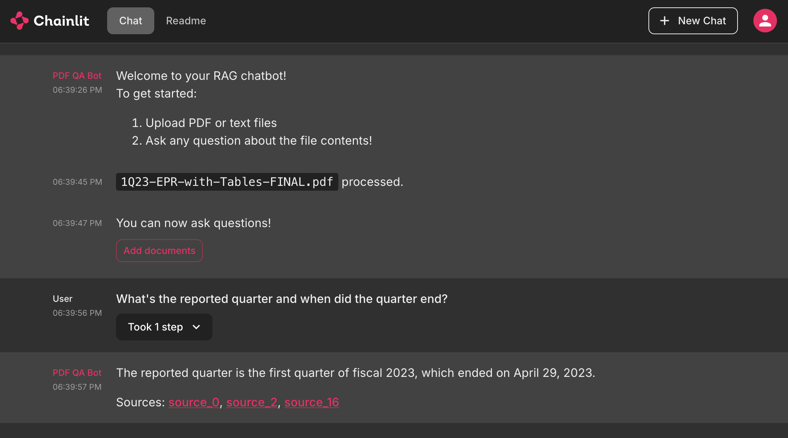

# simple-rag-chat

[](https://www.codefactor.io/repository/github/brendancsmith/simple-rag-chat)


This is a simple retrieval-augmented generation (RAG) chat application using OpenAI, Chainlit, Langchain, and Chroma.

The app provides an chat interface that asks user to upload PDF or text documents and then allows the user to ask questions against the provided documents. It uses OpenAI's API for the chat and embedding models, Langchain for the framework, Chainlit as the fullstack interface, and Chroma for the vector database.

## Interface
The following is an example chat using [Gap Q1 2023 Earnings Release](samples/1Q23-EPR-with-Tables-FINAL.pdf) as the uploaded PDF:



## 🧰 Stack

- [Python](https://www.python.org/downloads/release/python-3100/)
- [Langchain](https://python.langchain.com/docs/get_started/introduction.html)
- [Chainlit](https://docs.chainlit.io/overview)
- [Chroma](https://www.trychroma.com/)
- [OpenAI](https://openai.com/)

## 👉 Getting Started

We use [Python Poetry](https://python-poetry.org/) for managing virtual environments and we recommend using [pyenv](https://github.com/pyenv/pyenv) to manage Python versions.

Install and start the Poetry shell as follows.
```bash
poetry install
poetry shell
```

Please create an `.env` file from `.env.sample` once the application is installed. Edit the `.env` file with your OpenAI org and OpenAI key.
```bash
cp .env.sample .env
```

### ⏯️ Run the Application

Run the application by:
```bash
chainlit run app/app.py -w
```

## LICENSE

This repository is an extension of [llm-pdf-qa-workshop](https://github.com/leehanchung/llm-pdf-qa-workshop) by Hanchung Lee, licensed under GPLv3.
